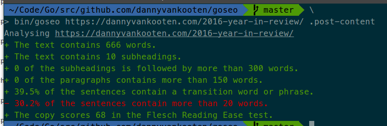

goseo
======
[](https://goreportcard.com/report/github.com/dannyvankooten/goseo)
[](https://raw.githubusercontent.com/dannyvankooten/goseo/master/LICENSE)

goseo is a command line tool to assess readability and SEO score for any HTML document or web page.




### Usage

Synopsis: `goseo [location] [selector]`

The command accepts accepts any HTML file or URL as its first argument, followed by an optional CSS selector pointing to the main article body.

```sh
goseo https://dannyvankooten.com/2016-year-in-review/ .post-content
```


### Downloading

You can [build from source](#building-from-source) or install one of the [prebuilt binaries from the GitHub releases page](https://github.com/dannyvankooten/goseo/releases).


### Building from source

To build goseo from source, take the following steps.

1. Ensure [Golang](https://golang.org/doc/install) is installed & configured properly.
2. Clone the repository: `git clone git@github.com:dannyvankooten/goseo`
3. Run `go build` from the repository's root directory.


### License

MIT licensed.
