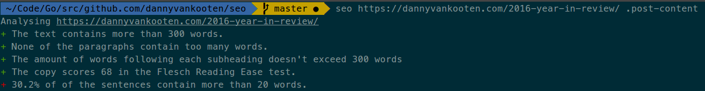

goseo
======

goseo is a command line tool to assess readability and SEO score for any HTML document or web page.



# Usage

Synopsis: `goseo [location] [selector]`

The command accepts accepts any HTML file or URL as its first argument, followed by an optional CSS selector pointing to the main article body.

```sh
goseo https://dannyvankooten.com/2016-year-in-review/ .post-content
```

# Building from source

To build goseo from source, take the following steps.

1. Ensure [Golang](https://golang.org/doc/install) is installed & configured properly.
2. Clone the repository: `git clone git@github.com:dannyvankooten/goseo`
3. Run `make` from the repository's root directory.

Pre-built binaries for OSX, Linux and Windows will be available soon.

# License

MIT licensed.
